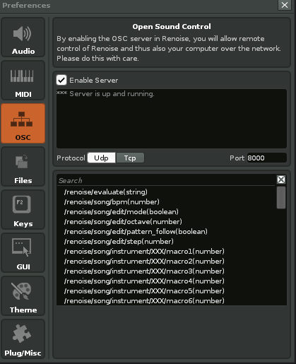

## Renoise Remote Control

Tiny lib to control Renoise over OSC.

## Renoise configuration

In preferences, enable OSC server on UDP port 8000



## Usage

`renoise-rc.core` contains a light wrapper to send OSC commands to renoise.

`renoise-rc.live` use above namespace, and provides short functions to manipulate 
renoise from the REPL.

```clojure
(in-ns 'renoise-rc.live)
=> #object[clojure.lang.Namespace 0x5de12cbc "renoise-rc.live"]
(play)
=> nil
(bpm 128)
=> nil
(stop)
=> nil
```